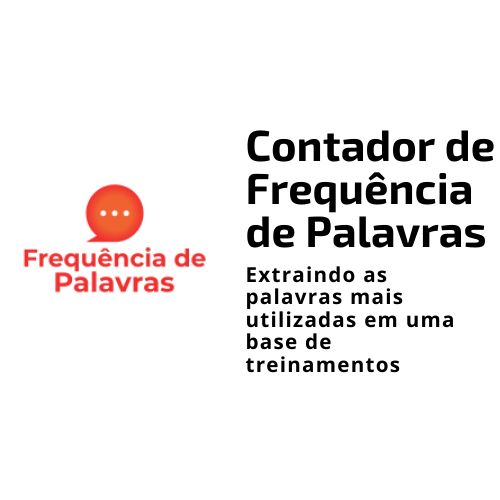

<h1 align="center">
    
</h1>

<h4 align="center"> 
	🚧 Frequência de Palavras 1.0 🚀 em desenvolvimento... 🚧
</h4>

<p align="center">
  

  

  	
  <a href="https://www.linkedin.com/in/emerson-rafael/">
    
  </a>
	
  
  <a href="https://github.com/emersonrafaels/frequencia_palavras_base_treinamento/commits/main">
    
  </a>

  
   <a href="https://github.com/emersonrafaels/frequencia_palavras_base_treinamento/stargazers">
    
  </a>
</p>


## 💻 Sobre o projeto

📦 **Frequência de palavras** é um projeto que obtém a **frequência* com que as **palavras** são **mencionadas nos comentários de uma base de treinamento**. 

A frequência de uma palavra ou **frequência de um termo (tf)** é uma **questão central na mineração de dados**.

## 🛠  Tecnologias

As seguintes ferramentas foram usadas na construção do projeto:

- [Python]

## ✍️  Técnicas utilizadas

 - **Tokenização** - É o processo de segmentar o texto em _tokens_, que são as formas mais elementais (geralmente palavras e pontuação) que carregam significado. O processo de tokenização deve levar em consideração detalhes como, por exemplo, se determinada pontuação indica ou não separação de tokens. Por exemplo, na frase _“Vou viajar pra N.Y.”_, o segmento _N.Y._ indica a entidade _Nova York_, e deve ser considerado um único token. Os modelos disponíveis no spaCy permitem essa tokenização especializada, produzindo resultados altamente adequados para as tarefas seguintes.
 - **Lematização** - Esse processo reduz as flexões das palavras ao seu _lemma_ ou raiz. Por exemplo, a palavra no plural _aviões_ é derivada do lemma _avião,_ assim como o verbo _assistimos_ tem origem no lemma _assistir._ A lemmatização costuma simplificar e generalizar os resultados de algumas tarefas de PLN posteriores.
 - **Remoção das Stop Words** - As stop words são atualmente as mais comuns em uma língua (como artigos, preposições, pronomes, conjunções, etc) e não trazem informações úteis ao texto. Exemplos de stopwords são: 'de', 'do', 'e', 'então'.
 - **Remoção de pontuações** - Como contarem a frequência de palavras, é útil remover as pontuações, evitando que elas sejam consideradas palavras.

## 🚀 Como executar o projeto

1. **Instalando**: pip install -r requirements.txt
2. **Executar o jupyter: Frequencia de palavras - Base de Treinamentos.ipynb**:

Os seus **parâmetros** estão na **etapa 2 - Variáveis Globais**:

```python
LANGUAGE = "portuguese"
CAMINHO_BASE_DADOS = r'BASE\BASE_TREINAMENTO.xlsx'

# NOME DAS COLUNAS DO DATAFRAME

NAME_COLUMN_MODULO = 'Selecione o treinamento que você participou recentemente:'
NAME_COLUMN_FRASES = 'Compartilhe conosco seus comentários, sugestões ou elogios com o treinamento.'

# NOME DAS COLUNAS TARGET

NAME_COLUMN_RESULT_MODULO = 'MÓDULO'
NAME_COLUMN_FRASES_POS_PROCESSING = 'COMENTARIOS_POS_PROCESSING'
NAME_COLUMN_WORDS_RAW = 'PALAVRAS'
NAME_COLUMN_WORDS_FREQUENCY = 'FREQUENCIA_PALAVRA'

# DEFININDO A QUANTIDADE DE PALAVRAS MAIS FREQUENTES DESEJADAS

QUANTIDADE_MAIS_FREQUENTES = 100

# CONFIGURANDO A VISUALIZAÇÃO DOS DATAFRAMES

pd.set_option('display.max_rows', 10)
pd.set_option('display.max_columns', 500)
pd.set_option('display.width', 1000)
```


## ➊ Pré-requisitos

Antes de começar, você vai precisar ter instalado em sua máquina as seguintes ferramentas (O download pode ser realizado pela própria página do Python ou Anaconda):
[Python](https://www.anaconda.com/products/individual).

## 📝 Licença

Este projeto está sob a licença MIT.

Feito com ❤️ por **Emerson Rafael** 👋🏽 [Entre em contato!](https://www.linkedin.com/in/emerson-rafael/)

[Python]: https://www.python.org/downloads/